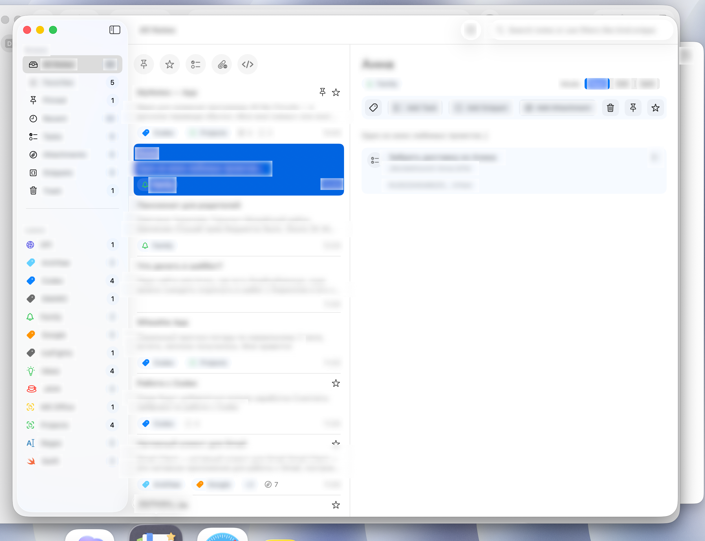
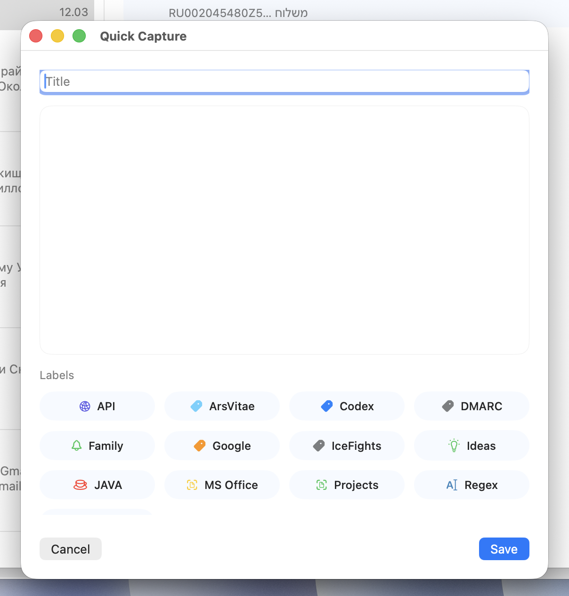

# Scriptoria

**A native Apple workspace for notes, tasks, snippets, attachments, and fast capture.**

`Scriptoria` is built for people who collect ideas all day, move between writing and execution, and want one calm place for everything: notes, labels, tasks, code, files, and search.

Current app bundle: `MyNotes`  
Current release: `0.95 (0834300626)`
Repository: [G5023890/Scriptoria](https://github.com/G5023890/Scriptoria)

## Hero

Most tools force you to choose one mode of thinking.

- notes app for writing
- task app for planning
- snippets app for code
- file browser for assets
- search tool for finding things again

`Scriptoria` combines those workflows into one native macOS workspace. You can capture an idea, turn part of it into a task, attach files, save code snippets, label it visually, and still find it later with structured search.

## Why It Feels Different

- Native macOS and iOS apps, not wrapped web UIs
- Three-column workspace optimized for scanning and editing
- Local-first behavior for fast interaction
- Notes, labels, tasks, snippets, and files stay connected
- Quick Capture lets you save ideas without breaking flow
- Search is built for both casual recall and power-user filtering

## Who It's For

- Developers who keep research notes, snippets, todos, and files together
- Founders and operators who need one working inbox for ideas and execution
- Writers and researchers who want labels, search, and structured note history
- Power users who prefer native macOS apps over browser-heavy workflows
- Anyone building a personal knowledge base that needs to stay actionable

## What You Can Do

### Notes

- Create notes instantly from the toolbar or with `Cmd+N`
- Edit title and body
- Switch between `Read` and `Edit` modes
- Keep archived note items grouped in a dedicated bottom `Архив` section
- Pin important notes
- Mark favorites
- Move notes to Trash, restore them, or empty Trash

### Labels

- Create labels while working with a note
- Assign multiple labels to the same note
- Browse notes by label from the sidebar
- Edit label names from the sidebar
- Customize label icons with SF Symbols
- Customize label icon colors with a fixed palette
- See the same label styling in sidebar rows, chips, pickers, and Quick Capture

### Tasks

- Add tasks inside notes
- Edit task text, details, and due dates
- Support due dates with or without time
- Mark tasks complete and reopen them
- Keep completed tasks marked as `Done` while also grouping archived ones inside note detail
- Reorder tasks inside a note
- Soft-delete, restore, or permanently remove tasks
- Review all tasks in global sections: `Overdue`, `Today`, `Upcoming`, `No Date`, `Completed`

### Notifications

- Schedule local reminders for tasks with due dates
- Complete tasks directly from a notification
- Snooze for one hour
- Snooze until tomorrow morning
- Jump from a notification back into the exact note and task

### Attachments

- Import files directly into notes
- Work with images, PDFs, code files, video, audio, and generic files
- Archive attachments out of the active note section without deleting them
- Preview attachments with Quick Look
- Open attachments in the system
- See inline thumbnails for local image attachments

### Code Snippets

- Detect snippets from note content
- Create manual snippets
- Edit, archive, and remove manual snippets
- Preview snippets in a dedicated sheet
- Copy code to clipboard
- Highlight syntax with `Highlightr`
- Switch preview language manually when needed

### Search

- Search across titles, note content, labels, snippets, and attachment names
- Use quick filters for pinned, favorites, tasks, attachments, and code
- Use structured tokens such as `is:pinned`, `has:tasks`, `label:<name>`, `type:code`, `updated:today`, `language:<name>`, `kind:snippet`, `in:attachments`
- Use quoted phrases for more precise results

### Quick Capture

- Open a dedicated Quick Capture window
- Create a note from anywhere in your workflow
- Add title, body, labels, pin state, and favorite state immediately
- Save and jump straight into the created note

## Screenshots

Real screenshots from the current app build.

### Main Workspace



Three-column workspace with smart collections, labels, note list, and detail view.

### Quick Capture



Fast note capture window with labels, pin, and favorite controls.

More screenshots for label editing and task-focused flows will be added in the next pass.

## Product Experience

`Scriptoria` is built as a native three-column macOS app:

- sidebar for smart collections and labels
- main list for notes or global tasks
- detail area for reading and editing

The sidebar currently includes:

- `All Notes`
- `Favorites`
- `Pinned`
- `Recent`
- `Tasks`
- `Attachments`
- `Snippets`
- `Trash`

Each collection shows a live count so the workspace stays scannable as it grows.

## Release 0.95 (0834300626)

- macOS and iOS now synchronize through a private custom CloudKit zone
- Incremental pulls persist and reuse `CKServerChangeToken`
- Local sync work is compacted and processed in deterministic parent-before-child order
- Notes, labels, tasks, snippets, and attachments retain soft-delete records for sync
- Attachment upload metadata is repaired from the local file when size or checksum is stale
- Downloaded attachments must pass size and SHA-256 checksum validation before acceptance
- Attachment repair work is bounded so it cannot indefinitely block newer changes
- CloudKit zone callbacks are guarded against duplicate continuation completion
- Sync-driven UI notifications are delivered on the main actor
- Full snapshot transport remains available as reconciliation code rather than the normal sync path

Known limitation: permanently purging an item before its soft-delete record has synchronized can
remove the tombstone source. A dedicated tombstone table is planned before hard-delete workflows
are treated as fully offline-safe.

## Roadmap

Near-term priorities:

- Add a dedicated durable tombstone store for permanently purged entities
- Expose full-snapshot reconciliation as an explicit repair operation
- Add a manual Sync control on macOS and iOS
- Expand automated offline, relaunch, conflict, delete, and attachment test coverage
- Continue refining the native Liquid Glass visual language and interactions

Already present in the codebase:

- local outbox and sync queue
- CloudKit custom zone and record mapping
- persistent server change token
- conflict-resolution policy
- attachment integrity checks and bounded repair
- sync status reporting

Current status: CloudKit transport is active for the private database. Normal operation uses
incremental custom-zone changes; full snapshots are retained for repair and reconciliation.

## Technology

- Swift
- SwiftUI
- Observation
- SQLite
- CloudKit
- UserNotifications
- Quick Look
- `Highlightr`

## Project Structure

- `MyNotes/App` — app bootstrap, routing, scenes, coordinator
- `MyNotes/Features` — user-facing features by domain
- `MyNotes/Domain` — use cases and policies
- `MyNotes/Data` — repositories, database, local storage, sync queue, and sync mapping
- `MyNotes/Core` — models, services, types, and utilities
- `MyNotes/UI` — design system primitives and shared components
- `scripts/build_and_install_app.sh` — release build, signing, bundling, and install flow

## Build And Install

Requirements:

- latest macOS and iOS beta releases
- Xcode-beta
- Swift Package Manager support
- optional Apple Development signing identity for stable signed installs

Debug build:

```bash
swift build
```

Build, sign, package, and install into `/Applications/MyNotes.app`:

```bash
./scripts/build_and_install_app.sh
```

The macOS install script:

- builds a release binary
- creates a full `.app` bundle
- injects `Info.plist`
- preserves bundle identifier `com.grigorym.MyNotes`
- applies the app icon from `assets/AppIcon.icns`
- signs with an Apple Development identity when available
- installs the app into `/Applications/MyNotes.app`
